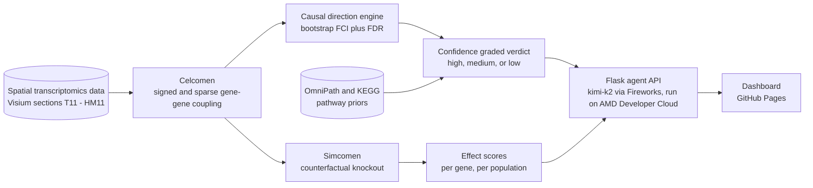

# PerTurbo

An agentic AI tool for in silico gene perturbation across diseases, powered by spatial transcriptomics, causal discovery, and a Fireworks LLM backend.

Built for the AMD Developer Hackathon Act II, Track 3 (Unicorn).


## The product

PerTurbo turns a spatial transcriptomics model into something a biologist can actually interrogate. You ask a question in plain language, for example what should I target in the liver metastasis, and the agent answers by ranking cell populations, pulling up the genes that drive them, mapping where the effect lands in the tissue, drawing the coupling network, and showing what public databases already know about each candidate. Every answer plays out as a short, narrated sequence, so a researcher watches the reasoning instead of reading a wall of text or a bare gene list.

This is not a search engine over papers. It is a causal reasoning system built on real patient tissue, with a Fireworks LLM layer that explains what it found and why it matters.

## Why we built it

Target discovery from spatial data usually stops at a static figure or a gene list, and two things bother us about that. First, a list does not tell you why a gene made the cut or how far to trust it. Second, most tools quietly present model output as if it were fact. PerTurbo tries to fix both. It explains each call with the evidence behind it, grounds the biology against real databases, and never once says proven target. Everything it shows is a prediction that still needs a wet lab.

## What you can do with it

A researcher can find targets in the primary tumour or the metastasis, returning ranked populations with a predicted tumour suppression effect, spot counts, and cross compartment flags. They can evaluate their own gene list by pasting candidates and getting a prioritise, consider, or deprioritise verdict against the model. They can compare primary versus metastasis to see how a population's signal shifts between the two sites. They can read the coupling network, an interactive node link graph of the gene to gene couplings with hubs, upstream genes, and per gene focus, and open the spatial maps showing the predicted knockout effect across the tissue. For any gene, they can pull external evidence and get a live dossier from Open Targets, DGIdb, Europe PMC, and ClinicalTrials.gov. And they can export a self contained report, either as an HTML file or a print ready PDF, covering every analysis in the session including the agent's own written conclusions.

## Live demo

The interactive dashboard runs from a separate repository dedicated to the GitHub Pages deployment.

Try it live: https://plazanas.github.io/PerTurbo-Dashboard/

Frontend source code: https://github.com/plazanas/PerTurbo-Dashboard

This repository holds the scientific backbone, the causal engine, the precompute pipeline, and the agent API the dashboard talks to.

## How the pieces connect



The precompute pipeline trains the coupling model and runs the counterfactual knockouts and the causal direction engine offline, writing compact artifacts. The agent API serves those artifacts and wraps them in the LLM layer. The agent itself, its choreography of the dashboard, and the live interface are in the frontend repository linked above.

## Repository structure

The repository separates the offline science from the runtime product. This split is also the licensing boundary (see the Celcomen licence section below).

```
agent/                  The runtime product. Contains NO Celcomen code — MIT-licensed.
  perturbo_agent_api.py          Flask API: brain + LLM tool loop + presentation-script builder
  gene_knowledge.py              live external-evidence lookup (stdlib only)
  requirements.txt               flask, openai
backend_precompute/     Offline pipeline that generates the artifacts the agent serves. Uses Celcomen (GPL-3.0).
  perturbo_precompute_fast.py    ranks populations, drills gene targets, saves spatial maps
  perturbo_network_export.py     exports the coupling networks (undirected couplings + directed priors)
experiments_validation/ Validated scientific analysis (Jupyter / Colab) + the causal engine. Uses Celcomen (GPL-3.0).
  Celcomen_Experiments_and_Validation.ipynb
  Celcomen_Methodology_Models.ipynb
  causal_directions.py           causal direction engine (bootstrap FCI + FDR + OmniPath/KEGG priors)
LICENSE
README.md
```

The `agent/` server imports no Celcomen code; it reads the JSON artifacts and serves them. The
`backend_precompute/` pipeline and the notebooks in `experiments_validation/` use Celcomen as an installed
dependency to produce those artifacts.

## Running it

### 1. The agent API (runtime, MIT, Celcomen-free)

```bash
cd agent
pip install -r requirements.txt
export PERTURBO_LLM_API_KEY=...            # your Fireworks key (or any OpenAI-compatible endpoint)
export PERTURBO_LLM_BASE_URL=https://api.fireworks.ai/inference/v1
export PERTURBO_LLM_MODEL=accounts/fireworks/models/kimi-k2p6
export PERTURBO_DATA=perturbo_data.json    # path to the precomputed artifact (see step 2)
python perturbo_agent_api.py --port 8000
```

The server binds `0.0.0.0:8000` and starts immediately, because it reads precomputed artifacts rather than
training anything. Without an LLM key, the data endpoints still work and `/chat` returns a graceful message.
To serve the dashboard from the same origin (avoiding CORS entirely), add `--static /path/to/dashboard`.

**Endpoints** (CORS enabled, OPTIONS preflight answered, `/chat` never crashes):

| Method | Endpoint | Purpose |
|---|---|---|
| GET  | `/health` | `{ ok, has_llm, sections }` |
| GET  | `/sections` | available samples |
| GET  | `/network` | coupling networks JSON |
| GET  | `/map?section=&population=` | spatial-effect PNG |
| POST | `/discover` | `{ section, n }` → ranked targets |
| POST | `/evaluate` | `{ genes, section }` → prioritise / consider / deprioritise |
| POST | `/chat` | `{ message, history }` → `{ reply, script, history }` |
| POST | `/knowledge` | `{ gene, disease }` → grounded external-evidence dossier |

### 2. The precompute (offline, requires the Celcomen/GPL environment + spatial data)

```bash
cd backend_precompute
pip install -r requirements.txt
python perturbo_precompute_fast.py --steps 80      # ranked targets + spatial maps (one-time, heavy)
python perturbo_network_export.py --from-model     # coupling networks + sign concordance
```

This writes `perturbo_data.json`, `network.json`, and the spatial-effect PNGs; point the agent at them with
`PERTURBO_DATA` (and place the PNGs where the agent's `/map` endpoint can find them).

### 3. The notebooks (reproduce the science)

The `experiments_validation/` notebooks are the validated analysis behind the tool. Open in Jupyter,
JupyterLab, or Google Colab and run top to bottom. Each is self contained and states its own assumptions and
honest limitations inline.

`Celcomen_Experiments_and_Validation.ipynb` trains Celcomen on two matched pancreatic ductal adenocarcinoma sections, one primary tumour and one liver metastasis, applies Simcomen counterfactual knockouts, and validates the results against a battery of noise controls including bootstrap seeds, permutation nulls, and shuffled graph controls.

`Celcomen_Methodology_Models.ipynb` characterises capacity, generalisation, and identifiability across four model variants, the original Celcomen coupling, a graph attention autoencoder, a constrained GGAT, and a doubly stochastic attention extension, using a spatial block validation split to remove message passing leakage between training and held out regions.

`causal_directions.py` runs the causal direction engine, bootstrap resampled FCI with FDR correction and OmniPath and KEGG pathway priors, that powers the live agent's confidence graded verdicts.

## Not only for one disease, a rich, swappable environment

We built and validated PerTurbo on two matched pancreatic ductal adenocarcinoma sections, one primary tumour and one metastatic sample, because that is the disease context we work in and had matched data for. But PerTurbo is not PDAC specific, and this is central to the product, not a footnote.

The underlying environment is deliberately generic, it consumes a spatial transcriptomics object and a driver gene table, and everything downstream, the causal coupling model, the counterfactual perturbation, the bootstrap calibrated direction calls, the clinical trial lookup, operates on whatever tissue compartments and gene panel are provided.

That means PerTurbo can be pointed at any cancer with a spatial transcriptomics dataset and a meaningful compartment boundary, non cancer diseases with spatially structured tissue pathology such as fibrosis or inflammatory bowel disease, and multiple platforms including Visium and Xenium.

## How PerTurbo finds causality

The foundation is an identifiable gene to gene coupling learned by a Celcomen style graph model, kept identifiable by holding the incoming neighbour weight constant. The coupling is undirected on its own, so PerTurbo layers a causal discovery pipeline on top, FCI resampled across bootstraps to report a stability fraction and to distinguish a real directed arrow from a shared latent factor, Benjamini Hochberg FDR correction, effect size alongside significance, and OmniPath and KEGG as literature priors. A gene pair is only called high confidence when several of these independent axes agree.

## Honest by design

This is the part we care about most, and it sits in the interface itself, not buried in a footnote. Every model output is labelled as a predicted, causal given model hypothesis, a prioritised in silico candidate, never a proven target. Celcomen is a symmetric model, so its couplings are undirected associations, and any directional arrow shown is overlaid from literature priors rather than learned from the data itself. The network's sign concordance against those literature priors runs close to chance, and we report that plainly rather than dressing it up as validation. External database records are shown exactly as returned, and a drug or trial appearing next to a gene does not by itself mean it works against that target.

## Honest limits from our own validation

The signed stroma to tumour cross block is consistently negative and reproducible in direction across seeds, but it does not yet separate from a permutation null at Visium spot resolution, and the effect behaves as tissue wide rather than sharply local. This is consistent with multi cell averaging inside each spot washing out a genuine local niche signal, and it is not a failure of the model so much as the ceiling of what spot level data can show. Single cell spatial resolution such as Xenium is the natural next step, and is discussed in the notebooks.

## Tech stack

The model is Celcomen, extended in this repository for signed and sparse gene to gene couplings over matched 10x Visium sections. The agent is a Flask API orchestrating kimi-k2 through the Fireworks API, and the full agent was run inside the AMD Developer Cloud notebook environment; self hosting the model on AMD Instinct MI300X via vLLM is a supported deployment path. The frontend is a static site in vanilla JavaScript with Chart.js for charts and html2canvas for image export, with no build step. External evidence is pulled live from Open Targets, DGIdb, Europe PMC, and ClinicalTrials.gov.

## Data and method

The data is one PDAC patient, a primary tumour labelled T11 and a liver metastasis labelled HM11, from GEO accession GSE272362, Khaliq et al. The underlying method is described in Megas et al., Celcomen, spatial causal disentanglement for single cell and tissue perturbation modeling, Nature Communications, 2026, preprint at arXiv 2409.05804.

## Celcomen: what we used, and its licence

PerTurbo's causal engine is built directly on Celcomen (Megas, Chen, Polanski, Asadollahzadeh, Eliasof, Schönlieb, Teichmann, Wellcome Sanger Institute and University of Cambridge), published in Nature Communications. We use both its inference module, CCE, to learn the signed gene gene coupling, and its generative counterfactual module, SCE or Simcomen, to simulate perturbations.

Celcomen is distributed under the GPL-3.0 licence. We use it as intended, as an installed dependency, not by copying or modifying its source into this repository, and we credit it explicitly here and in every notebook. The `backend_precompute/` pipeline and the notebooks in `experiments_validation/` depend on Celcomen and therefore run in a GPL environment. The `agent/` server contains no Celcomen code (verified: no Celcomen import anywhere under `agent/`) and, together with the code in this repository that does not derive from Celcomen, is released under the MIT License, matching the frontend repository; see LICENSE.

## Environment

```
Python 3.11

# agent/ (runtime, MIT) — no Celcomen
flask, openai

# backend_precompute/ and experiments_validation/ — use Celcomen (GPL-3.0)
celcomen, simcomen (Teichmann lab, GPL-3.0)
scanpy, anndata, torch, torch-geometric
causal-learn, statsmodels, omnipath

# LLM
Fireworks AI API
```

## Team

Evangelia Kourtzelli, Ioulios Konstantelos, Panagiotis Lazanas.

MSc Data Science and Information Technologies
National and Kapodistrian University of Athens
AMD Developer Hackathon Act II, Track 3 (Unicorn)

## Disclaimer

PerTurbo produces predicted, causal given model hypotheses for research and demonstration. Nothing here is a validated drug target or clinical recommendation. Couplings are associations, directions are imported from literature rather than learned, and external records are shown as returned by their source databases.
